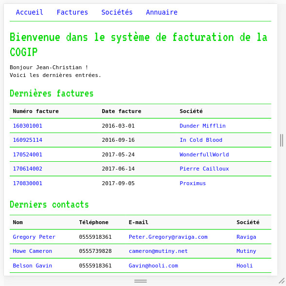

# COGIP

## requêtes SQL, routeur, MVC

Ce site est un prétexte pour voir la connexion PDO, les requêtes SQL, l'affichage des variables, les GET, le routeur, l'architecture MVC.

## Une application de facturation pour Jean-Christian Ranu

Deux versions de l'application :
- une [version simple sans MVC](version_no_mvc)
- une [version avec MVC simpliste](version_mvc) (pour comprendre la base des bases)

Pour le moment, il n'y a pas de d'administration, donc pas de session.
