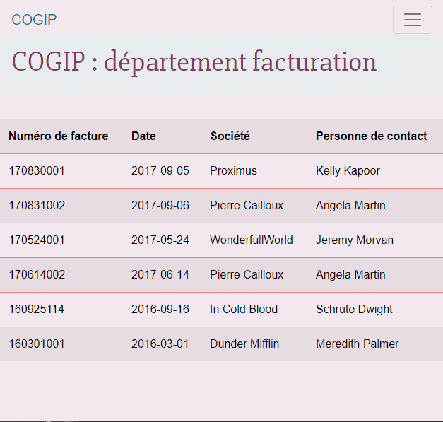

# COGIP version OOP

:construction_worker: :construction_worker: :construction_worker: EN TRAVAUX :construction_worker: :construction_worker: :construction_worker:

À améliorer :
supmember.php => le message d'erreur si on tente de s'autosupprimer.

## Organisation des dossiers

``index.php`` : C'est le fichier qui va être à la racine de ton site. Il est donc situé en dehors des dossiers. Le fichier va faire en sorte d'importer des fichiers sur toutes les pages. On importe donc le fichier ``connect.php`` (pour se connecter à la base de données. Également, selon le cas, il va charger :
- le fichier ``routeur.php`` si l'internaute n'est pas connecté ;
- le fichier ``routeur-admin.php`` si l'internaute est connecté.

### Controller

``routeur.php`` : Ce fichier va servir à diriger ou rediriger l'internaute en fonction de ses choix (lien sur lequel il a cliqué) et/ou en fonction de ses permissions. Le routeur, c'est souvent un switch mais pour cet exemple, le routeur est rédigé sous forme de condition if/elseif/else. Il prend en compte toutes les pages auxquelles l'utilisateur a un droit d'accès et définit une page par défaut qui va s'affiche dans le cas où y'a une tentative d'accès à une page qui n'existe pas.

``routeur-admin.php`` : Il reprend toutes les pages dont les utilisateurs non connectés ont accès et permet également l'accès à des pages permettant d'ajouter, modifier, supprimer des éléments (facture, contact et société). Il comprend également une option de déconnexion (logique, si on est connecté !)

### Model

``connect.php`` : Le fichier qui va permettre de faire le lien entre la base de données et le site internet.

``config.php`` : Ici, il n'y est pas mais normalement, on crée ce fichier pour stocker les données sensibles comme l'identifiant, le mot de passe, le nom de la base de données,... Ce fichier, on le place dans un .gitignore afin qu'il ne soit JAMAIS pushé sur GitHub.

``manifest.json`` : Fichier utilisé pour les Progressive Web Application.

``cogip.sql`` : Fichier SQL reprenant la structure et les données de la base de données utilisées pour le site.

Les pages ``detail----.php`` : Il s'agit d'afficher les détails concernant un élément précis. Une facture, une personne de contact, ou une société. le titre changera en fonction de l'ID sélectionné dans la base de données par la requête SQL.

Les pages ``new----.php`` : Les fichiers PHP préparant le bon affichage du formulaire d'insertion en HTML, la requête SQL et sa bonne exécution dans la base de données, et le message de réussite ou d'erreur.

Les pages ``modif----.php`` : Les fichiers PHP préparant le bon affichage du formulaire de modification en HTML (on va afficher les informations déjà dans la DB pour l'utilisateur), la requête SQL et sa bonne exécution dans la base de données, et le message de réussite ou d'erreur.

Les pages ``sup----.php`` : Les fichiers PHP préparant la requête SQL de suppression et sa bonne exécution dans la base de données, et la redirection.

``tous les autres fichiers`` : Contiennent les requêtes SQL qui vont récupérer les données à afficher dans les vues. On va également déterminer dans ce fichier la variable d'affichage qui contiendra le message d'erreur à afficher dans le cas où la requête SQL ne retourne pas de données à l'aide d'une condition. Également, on va générer une variable ``$title`` qui contiendra le titre de la page qui est chargée.

### View

``img`` : Dossier contenant les images. Il est important de bien organiser ses fichiers et de ne pas mettre les images et les fichiers php ensemble.

``css`` : Dossier contenant les fichiers CSS. RAPPEL : On place toujours le CSS dans un fichier CSS et pas dans le ``<head>`` de ses fichiers HTML. Même s'il n'y a qu'une ligne. Un fichier CSS pour gouverner tous les fichiers HTML !

``menu.php``, ``header.php``, ``footer.php`` : Ce sont des fichiers qui regroupent du code HTML à intégrer dans les différentes pages web. Les noms des fichiers sont tout de même assez explicites. RAPPEL : Comme le contenu sera identique sur toutes les pages, on regroupe le contenu sur un fichier unique qu'on appelle à un endroit précis de la page HTML à afficher. Dans le ``header.php``, o.n fait un appel à la variable ``$title`` qui est différente selon la page chargée.

``tous les autres fichiers`` : Dans la partie ``View``, il s'agira de coder la partie HTML qui s'affichera en plaçant aux bons endroits les boucles et les variables PHP contenant les données à afficher (et comme c'est trop long à écrire, j'appellerai ça des *variables d'affichage*).

Les noms des fichiers de la partie ``view`` et les noms des fichiers de la partie ``model`` se correspondent.
Il n'y a pas de fichiers ``view`` pour les pages de suppression car elle n'affiche rien, elle retourne directement sur le panneau d'administration.

## Ce qu'il y a de plus que dans la version précédente :
- du CRUD
- notion de suppression
- de la sanitanization
- de la vérification de formulaire basique en javascript
- un design un peu moins laid o//

## À ajouter ici ou dans la version avec droits d'administration
- Ajout d'un sanitizer pour les dates de facture
- Un système de tri pour les tableaux.

## Beauté

